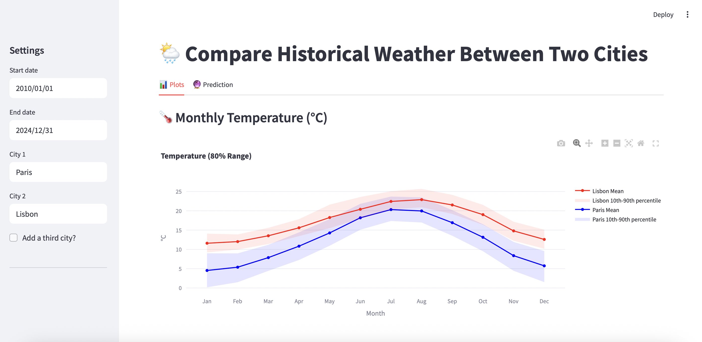

# 🌤️ City Weather Comparison App

This Streamlit app allows you to compare historical weather data — including temperature, humidity, sunshine hours, and rainfall — between two (or optionally three) cities. It's ideal for travelers, researchers, or anyone curious about climate patterns across different regions.

## 🚀 Features

- 📍 Compare 2 or 3 cities side-by-side  
- 📅 Select a date range for historical analysis  
- 📊 View temperature, humidity, rainfall, and sunshine hours  
- 🌐 Supports cities worldwide (based on OpenStreetMap Nominatim)  

## 🖥️ Live Demo

https://fededealba-compare-cities-weather-app-zglwfv.streamlit.app

## 🧰 Tech Stack

- [Streamlit](https://streamlit.io/)
- [Pandas](https://pandas.pydata.org/)
- [Plotly](https://plotly.com/python/)
- [Open-Meteo](https://open-meteo.com)

## 🛠️ Setup Instructions

1. **Clone the repo**:
   ```bash
   git clone https://github.com/yourusername/city-weather-comparison.git
   cd city-weather-comparison
   ```

2. **Install dependencies**:
   ```bash
   pip install -r requirements.txt
   ```

3. **Run the app**:
   ```bash
   streamlit run app.py
   ```

## 📁 File Structure

```
├── app.py              # Main Streamlit app
├── requirements.txt    # Python dependencies
└── README.md           # This file
```

## ⚠️ Notes

- Cities are matched based on a proximity search of weather stations. Results may vary depending on data availability.
- Some metrics (e.g. sunshine hours) might be missing for certain stations.

## 📸 Screenshots

