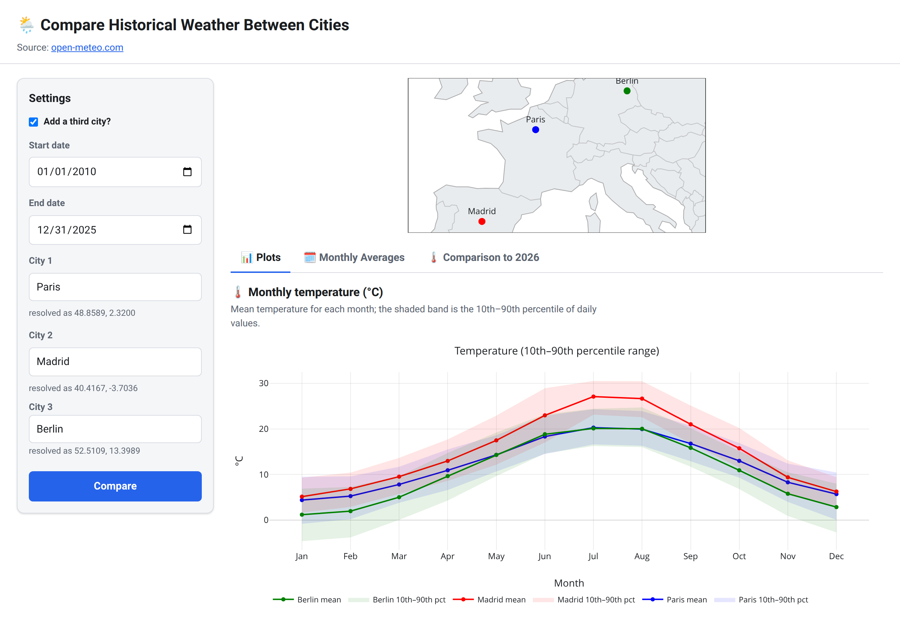

# 🌤️ City Weather Comparison App

Compare historical weather — temperature, humidity, sunshine hours and rainfall —
between two (or optionally three) cities. Useful for travellers, researchers, or
anyone curious about how climates line up across regions.

The app runs on **Vercel**: a static frontend (vanilla JS + Plotly.js) talks to
Python serverless functions that reduce Open-Meteo data to small summaries. The
original **Streamlit** version is still in the repo as [`app.py`](app.py).

## 🚀 Features

- 📍 Compare 2 or 3 cities side-by-side
- 📅 Pick a date range for the historical baseline
- 📊 Monthly temperature, humidity, rainfall and sunshine, with 10th–90th percentile bands
- ☀️ Daytime-only temperatures, using just the hours between local sunrise and sunset
- 🌡️ How the current year is running day by day against the historical average, shaded red where warmer and blue where cooler
- 🌧️ This year's accumulated rainfall against a typical year's, as a running surplus or shortfall
- 🌐 Cities worldwide, geocoded via the Open-Meteo geocoding API

## 🧰 Tech Stack

- Frontend: static HTML/CSS + vanilla JS, charts by [Plotly.js](https://plotly.com/javascript/)
- API: [Vercel Python functions](https://vercel.com/docs/functions/runtimes/python) (`api/*.py`)
- Data crunching: [pandas](https://pandas.pydata.org/) in [`weatherlib/`](weatherlib/), shared with the Streamlit app
- Weather + geocoding: [Open-Meteo](https://open-meteo.com) (the Streamlit `app.py` still geocodes via Nominatim/geopy)

## 🖥️ Run it locally

```bash
pip install -r requirements.txt
python dev_server.py            # → http://localhost:3000
```

`dev_server.py` serves `public/` and routes `/api/*` through the same functions
Vercel runs. It is not deployed.

<details>
<summary>Running the original Streamlit app instead</summary>

```bash
pip install -r requirements-streamlit.txt
streamlit run app.py
```
</details>

## ▲ Deploy to Vercel

No build step. With the [Vercel CLI](https://vercel.com/docs/cli):

```bash
vercel            # preview deploy
vercel --prod     # production
```

Or import the GitHub repo at [vercel.com/new](https://vercel.com/new) — the defaults
work (framework preset: **Other**). [`vercel.json`](vercel.json) sets the function
timeout to 60s and bundles the committed `.csv` caches into the function.

**What changes on Vercel:** the deployment filesystem is read-only, so a
newly-looked-up city is fetched live but not written back to the cache — it is
re-fetched next time. The ~30 cities already in `city_cache.csv` /
`weather_cache/` load instantly. Fully-successful responses carry an `s-maxage`
header so the CDN absorbs repeat traffic.

**About rate limits (429):** Vercel functions share egress IPs with every other
Vercel project, so Open-Meteo's per-IP limits can be hit by neighbours. Mitigations
in place: geocoding uses Open-Meteo rather than Nominatim (whose policy forbids
cloud traffic and blocks such IPs); the archive fetch retries a 429 with backoff;
the frontend staggers its per-city requests; partial responses aren't CDN-cached.
The durable fix if it still bites is to pre-generate more cache files (see
[Caching](#caching)) or add a persistent KV store for fetched summaries.

## 📁 Layout

```
├── public/             # Static frontend served at /
│   ├── index.html
│   ├── app.js          # Form handling + all the Plotly charts
│   └── styles.css
├── api/                # Vercel serverless functions
│   ├── weather.py      # GET /api/weather  — one city's full comparison payload
│   ├── geocode.py      # GET /api/geocode  — city name → lat/lon
│   └── _util.py        # shared request/response helpers (not a route)
├── weatherlib/         # Pure pandas logic, shared by the API and app.py
│   ├── aggregate.py    # daily/hourly series → the reduced summaries
│   ├── openmeteo.py    # Open-Meteo URL builders + fetch
│   ├── cache.py        # read-only access to weather_cache/
│   ├── geocode.py      # city_cache.csv, then Open-Meteo geocoding
│   └── service.py      # orchestration: assemble one city's payload
├── app.py              # Original Streamlit app (still works)
├── dev_server.py       # Local static + /api server
├── city_cache.csv      # Cached city → lat/lon
├── weather_cache/      # Cached Open-Meteo summaries (see below)
│   └── recent/         # Ranges ending near today (gitignored)
├── requirements.txt              # API / weatherlib deps (pandas, requests)
├── requirements-streamlit.txt    # + streamlit, plotly, geopy (for app.py)
└── vercel.json
```

### Caching

The caches are committed to the repo, so previously-looked-up cities load without
hitting Nominatim or Open-Meteo. Deleting a cache file just means it gets
re-fetched. Only **reduced summaries** are stored, never the raw daily or hourly
series the API returns — those run to megabytes per city and are one request away:

| File | Contents |
|---|---|
| `*_monthly.csv` | 12 rows: per-calendar-month means and percentiles |
| `*_records.csv` | 1 row: the hottest and coldest day of the range, with dates |
| `*_daytime.csv` | 12 rows: per-calendar-month daylight-only temperature stats |
| `*_daytime_climatology.csv` | 366 rows: average daytime temperature per day of the year |
| `*_precip_climatology.csv` | 366 rows: average accumulated rainfall by each day of the year |
| `*_daytime_daily.csv`, `*_precip_daily.csv` | one row per date — only kept for `recent/` ranges, where they are what the charts plot |

Ranges whose end date is within a week of today are treated as volatile: the
Streamlit app writes them under `weather_cache/recent/` (gitignored, pruned on
write), and the Vercel API always refetches them rather than trusting a committed
copy.

## ⚠️ Notes

- Cities are matched by a proximity search of weather stations; results vary with data availability.
- Some metrics (e.g. sunshine hours) may be missing for certain stations.
- Long historical ranges for an uncached city trigger a multi-decade hourly fetch, which can take a few seconds.

## 📸 Screenshot


